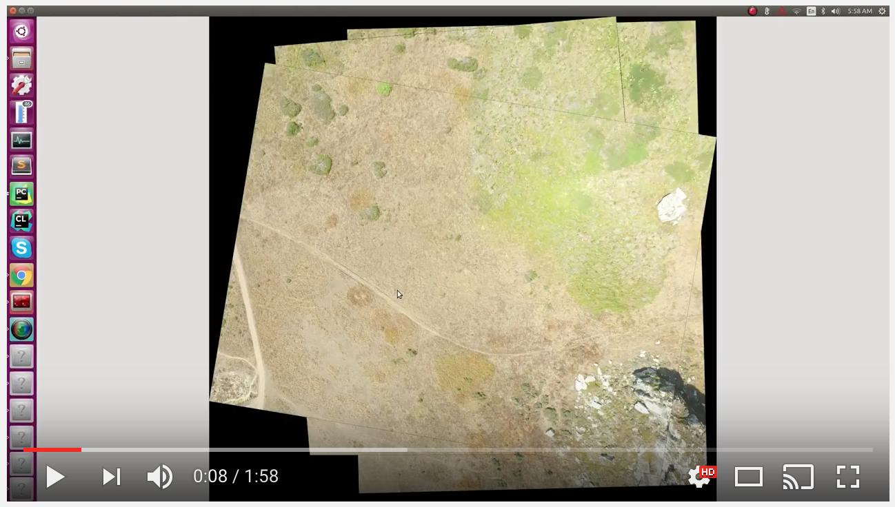

## Orthomosaic Generator

This project creates an orthomap given a dataset of n images and n corresponding camera poses. It is useful as a postprocessing step for data generated by SLAM techniques such as [ORB-SLAM](https://github.com/raulmur/ORB_SLAM2) to quickly visualize a scene, especially in cases when most of the imagery is nadir or close to nadir.  

A video of the mosaic process is below:

### Installation
This project was developed and tested using Python 2.7.10 on Ubuntu 15.10. It depends on NumPy 1.8.2 and OpenCV 2.4.11. Install and execute this project using the following commands:

    git clone https://github.com/alexhagiopol/ImageMosaic.git
    cd ImageMosaic
    mkdir results  # location where program places results
    mkdir datasets  # location where you place input data
    sudo apt-get update
    sudo apt-get install python-numpy python-opencv
    python ImageMosaic.py

### Example Data
An example "datasets" directory with images and camera poses is here: https://drive.google.com/file/d/0B_huqLwo5sS1U3lPMDV0c1NUSWs/view?usp=sharing

### Example Result
Results from the processed example datset are here: https://drive.google.com/open?id=0B_huqLwo5sS1WFBKbW00dU5QR1E

